# Recommender System

---

## Table of Contents

- [Overview](#overview)
- [Project Structure](#project-structure)
- [Dataset](#dataset)
- [Methodology](#methodology)
  - [0. Data Collection](#0-data-collection)
  - [1. Exploratory Data Analysis](#1-exploratory-data-analysis)
  - [2. Data Splitting](#2-data-splitting)
  - [3. SVD Matrix Factorization](#3-svd-matrix-factorization)
  - [4. Neural Collaborative Filtering](#4-neural-collaborative-filtering)
  - [5. Model Comparison](#5-model-comparison)
- [Results](#results)
- [Key Design Decisions](#key-design-decisions)
- [Getting Started](#getting-started)

---

## Overview

The goal of this project is to build a movie recommender system — the kind of system that powers the "Recommended for You" section on streaming platforms like Netflix. Given a user's history of movie ratings, the system predicts which unseen movies that user would enjoy most and surfaces the top recommendations.

I built two models and compared them head-to-head:

1. **SVD (Singular Value Decomposition)** — a classical linear algebra approach that I implemented from scratch using `scipy`. This serves as the baseline.
2. **Neural Collaborative Filtering (NCF)** — a deep learning approach built in PyTorch that combines two neural network pathways to learn complex user-movie interaction patterns. This is the cutting-edge model.

Both models were tuned using Bayesian hyperparameter optimization (Optuna) and evaluated using best-practice metrics from the recommender systems literature. All data lives in AWS S3 as Parquet files, and the notebooks are designed to run on AWS SageMaker.

---

## Project Structure

```
recommender_system/
├── 00_data_collection/
│   ├── notebook.ipynb          # Download MovieLens 1M, parse, upload to S3
│   └── output/
├── 01_eda/
│   ├── notebook.ipynb          # Exploratory data analysis
│   └── output/                 # 7 visualization PNGs
├── 02_split_data/
│   ├── notebook.ipynb          # Chronological train/valid/test split
│   └── output/                 # Split summary PNG
├── 03_svd/
│   ├── notebook.ipynb          # SVD matrix factorization
│   └── output/                 # Model artifact, tuning CSV, predictions, plot
├── 04_neural_collaborative_filtering/
│   ├── notebook.ipynb          # Neural Collaborative Filtering (PyTorch)
│   └── output/                 # Model artifacts, tuning CSV, predictions, plots
├── 05_comparison/
│   ├── notebook.ipynb          # Head-to-head model comparison
│   └── output/                 # Comparison visualizations
├── requirements.txt
└── README.md
```

---

## Dataset

I used the [MovieLens 1M](https://grouplens.org/datasets/movielens/1m/) dataset, a well-known benchmark in recommender systems research published by the GroupLens research lab at the University of Minnesota.

| Attribute | Value |
|-----------|-------|
| Total Ratings | ~1,000,000 |
| Unique Users | ~6,000 |
| Unique Movies | ~4,000 |
| Rating Scale | 1 to 5 (integer stars) |
| Time Range | April 2000 – February 2003 |
| User Features | Gender, age group, occupation, zip code |
| Movie Features | Title, genres (e.g., Action, Comedy, Drama) |
| Storage | `s3://recommender-system-demo/` (Parquet format) |

The dataset is sparse — most users have only rated a small fraction of the available movies. This sparsity is what makes recommendation challenging and interesting: the models need to fill in the gaps and predict how a user would rate a movie they have never seen.

---

## Methodology

### 0. Data Collection

The MovieLens 1M dataset is distributed as a zip file containing three `::` delimited `.dat` files. I downloaded the zip, parsed each file into a pandas DataFrame, converted Unix timestamps into human-readable dates, and uploaded the three resulting tables (ratings, users, movies) to S3 as Parquet files. No data is stored locally — all downstream notebooks read directly from S3.

### 1. Exploratory Data Analysis

Before building any models, I explored the data to understand its shape, distributions, and quirks. This step is critical because it informs decisions about preprocessing, splitting strategy, and model design.

**Rating Distribution**

I started by looking at how ratings are distributed across the 1-5 scale. This tells me whether users tend to rate generously or harshly, and whether the distribution is skewed.

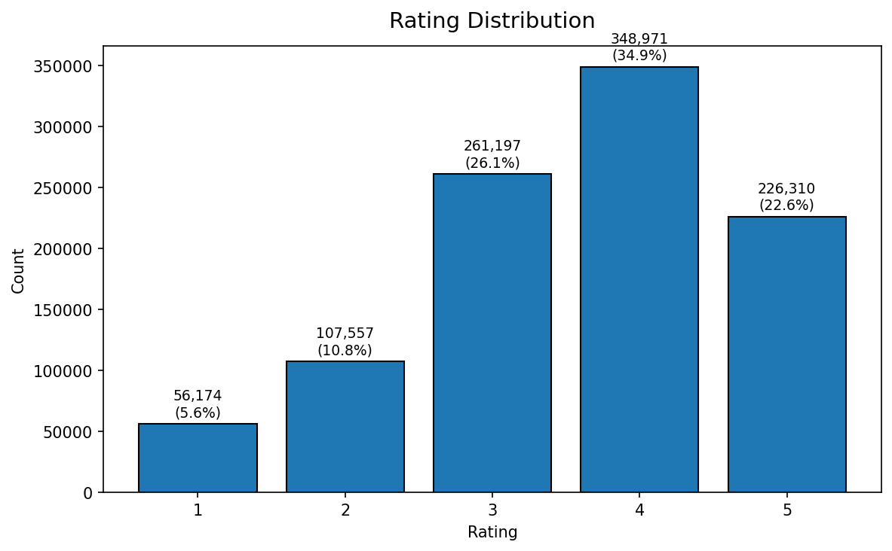

**Ratings Over Time**

I plotted both the volume of ratings and the average rating by month. This reveals temporal trends — for example, whether rating behavior changed over the dataset's three-year span — and confirms that a chronological split is appropriate.

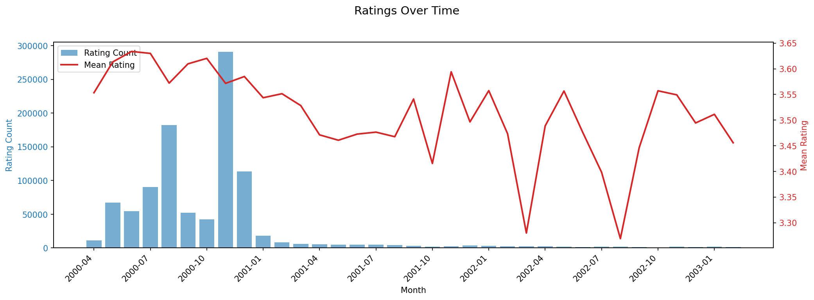

**User Activity Distribution**

Not all users are equally active. Some users rate hundreds of movies while others rate only a handful. I plotted the distribution of ratings per user on a log scale to understand how concentrated the activity is.

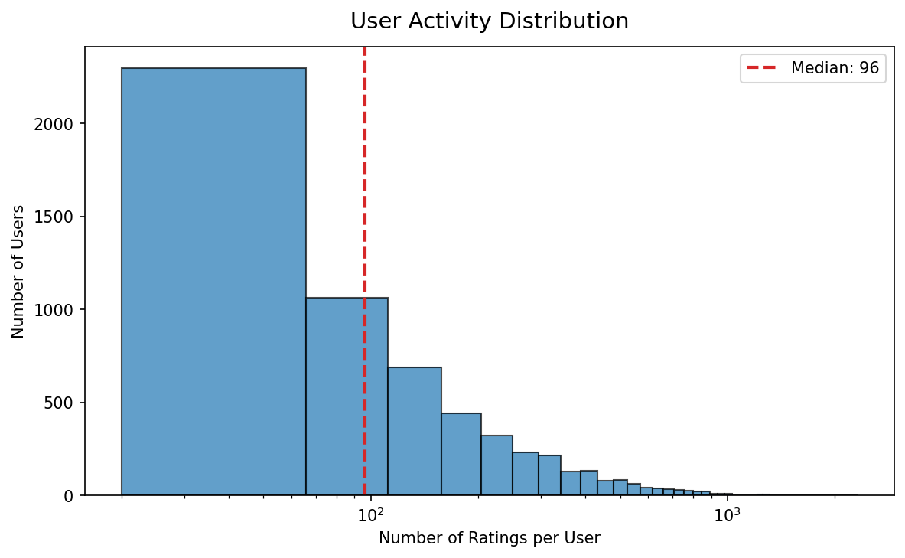

**Movie Popularity Distribution**

Similarly, some movies receive thousands of ratings while others receive very few. This "long tail" is a hallmark of recommendation problems — the most popular items dominate, but the real value of a recommender is surfacing relevant items from the tail.

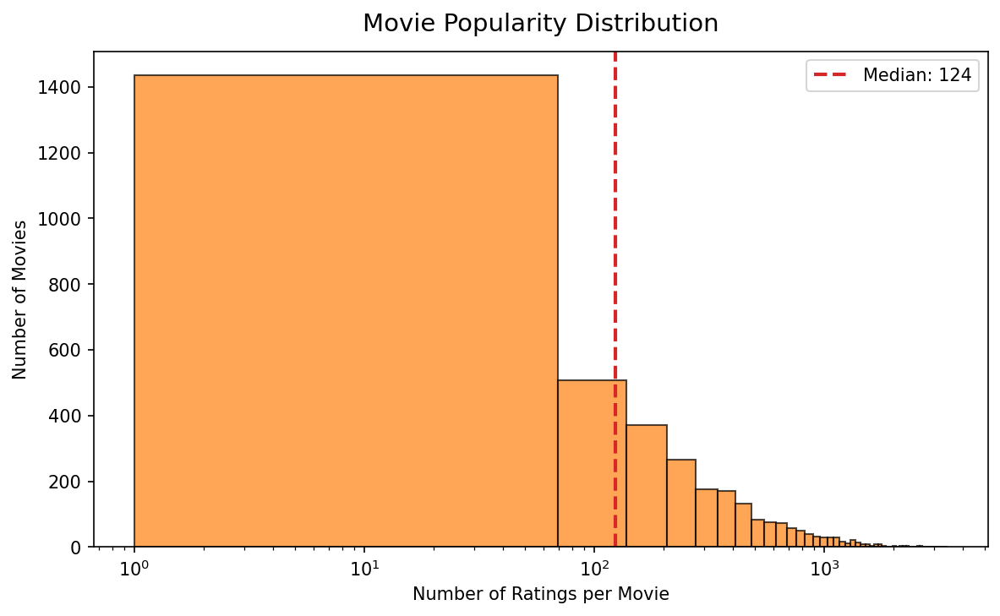

**Genre Analysis**

I split the multi-genre labels (e.g., "Action|Comedy") and analyzed both how frequently each genre appears and what the average rating is by genre. This helps me understand whether certain genres are systematically rated higher or lower.

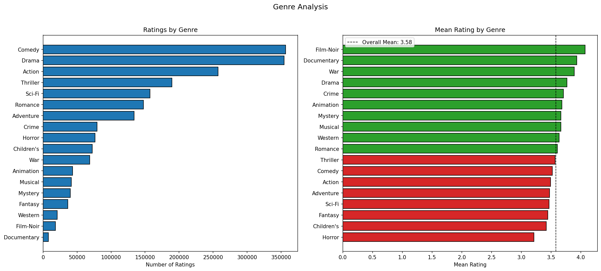

**Demographic Analysis**

I examined how rating behavior differs across gender and age groups. This is useful context for understanding whether the models might perform differently for different user segments.

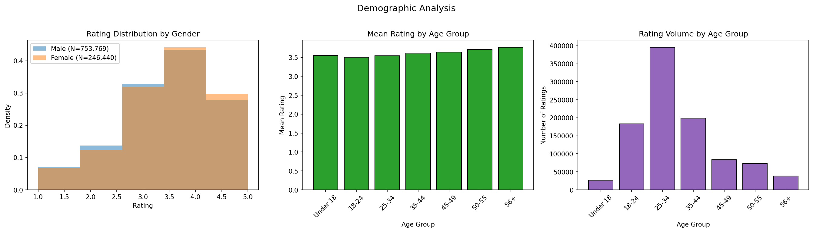

**User-Movie Interaction Heatmap**

Finally, I created a heatmap of the 20 most active users versus the 20 most popular movies. This visualizes the sparsity of the interaction matrix — even among the most active users and popular movies, many cells are empty (unrated). This is the core challenge the models need to solve.

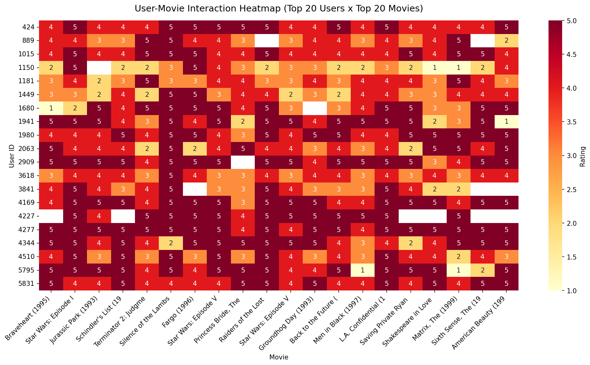

### 2. Data Splitting

I split the data chronologically: I sorted all ratings by timestamp and assigned the first 50% to training, the next 25% to validation, and the final 25% to testing.

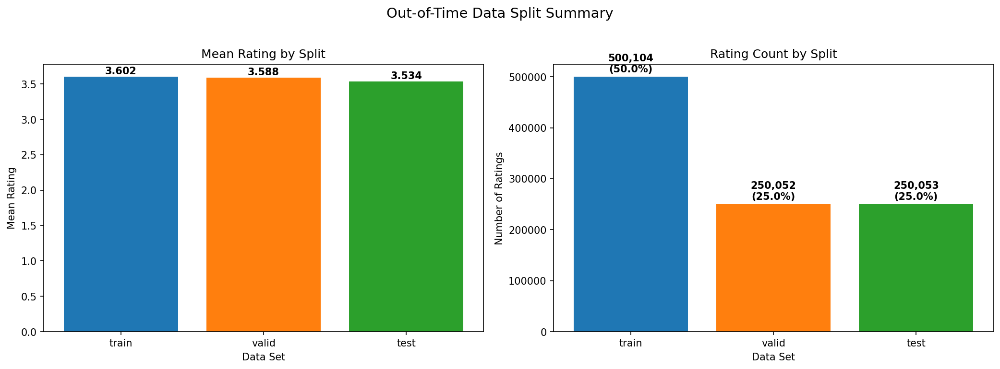

This is called an **out-of-time split**, and it is more realistic than a random split. In production, a recommender system is always trained on past data and asked to predict future behavior. A random split would leak future information into the training set, making the model appear better than it actually is. By splitting chronologically, I simulate how the model would perform if it were deployed at the boundary between the training and validation periods.

| Split | Proportion | Purpose |
|-------|-----------|---------|
| Train | 50% | The model learns user preferences from these ratings |
| Validation | 25% | I use this to tune hyperparameters and decide when to stop training |
| Test | 25% | Final held-out evaluation — the model never sees this data during training or tuning |

### 3. SVD Matrix Factorization

**What is SVD?**

SVD (Singular Value Decomposition) is a classical linear algebra technique. The idea is simple: I have a large, sparse matrix where rows are users, columns are movies, and each cell is a rating (or empty if the user hasn't rated that movie). SVD decomposes this matrix into three smaller matrices that, when multiplied back together, approximate the original — including filling in the empty cells with predicted ratings.

Think of it as discovering hidden "latent factors" — maybe one factor captures whether a user likes action movies, another captures a preference for indie films. Each user gets a vector of factor weights, each movie gets a vector of factor weights, and the predicted rating is computed by combining them.

**My implementation**

I did not use a pre-built library like Surprise. Instead, I implemented SVD from scratch using `scipy.sparse.linalg.svds` to demonstrate understanding of the underlying math. My implementation includes:

- **Bias terms**: Before decomposing, I subtract the global average rating, each user's personal bias (do they rate higher or lower than average?), and each movie's bias (is this movie generally rated higher or lower?). The prediction formula is: `global_mean + user_bias + item_bias + latent_interaction`.
- **Cold start handling**: If a new user or movie appears that wasn't in the training data, the model falls back gracefully to just the bias terms rather than failing.

**Hyperparameter tuning**

The key hyperparameter is `k` — the number of latent factors. Too few and the model is too simple to capture preferences; too many and it overfits to noise. I used Optuna (a Bayesian optimization framework) to search over `k` values from 10 to 200 across 30 trials. Optuna is smarter than a grid search because it learns from previous trials which regions of the search space are most promising.

The best model used **k=10** latent factors.

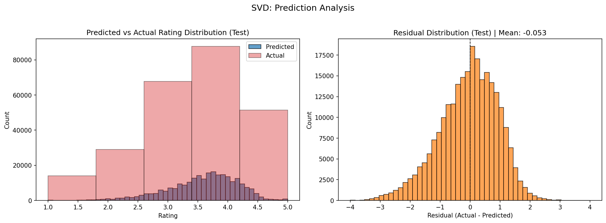

### 4. Neural Collaborative Filtering

**What is NCF?**

Neural Collaborative Filtering (NCF) is a deep learning approach to recommendation introduced by He et al. (2017). Instead of a linear decomposition like SVD, NCF uses neural networks to learn arbitrarily complex patterns in how users interact with items.

**Architecture**

The model I built combines two parallel pathways:

1. **GMF (Generalized Matrix Factorization)** — Each user and each movie gets an "embedding" (a learned vector of numbers). The GMF pathway computes the element-wise product of the user and movie embeddings. This is essentially a neural network version of traditional matrix factorization.

2. **MLP (Multi-Layer Perceptron)** — A separate set of user and movie embeddings are concatenated and passed through multiple hidden layers with ReLU activations and dropout regularization. This pathway can learn non-linear interaction patterns that GMF cannot.

The outputs of both pathways are concatenated and passed through a final layer to produce the predicted rating. This combined architecture is called **NeuMF** — it gets the best of both worlds: the efficiency of linear factorization and the expressiveness of deep networks.

**Training details**

- **Optimizer**: Adam (an adaptive learning rate optimizer that works well in practice)
- **Loss function**: Mean Squared Error between predicted and actual ratings
- **Early stopping**: I monitored validation loss each epoch and stopped training if it did not improve for 3 consecutive epochs. This prevents overfitting — the point where the model memorizes training data instead of learning generalizable patterns.
- **GPU acceleration**: The model automatically uses a GPU if available, with `pin_memory` and multi-worker data loading for efficient CPU-to-GPU data transfer.

**Hyperparameter tuning**

I used Optuna to tune five hyperparameters across 10 trials:

- **Embedding dimension** (8–128): How many numbers represent each user/movie
- **MLP depth** (1–3 layers): How deep the neural network is
- **Dropout rate** (0.0–0.5): How aggressively to regularize against overfitting
- **Learning rate** (0.0001–0.01): How fast the model updates its weights
- **Batch size** (512, 1024, 2048): How many ratings to process at once

The best model used **93-dimensional embeddings**, **3 hidden layers** (93, 46, 23 neurons), **3.7% dropout**, a **learning rate of 0.00456**, and a **batch size of 1024**.

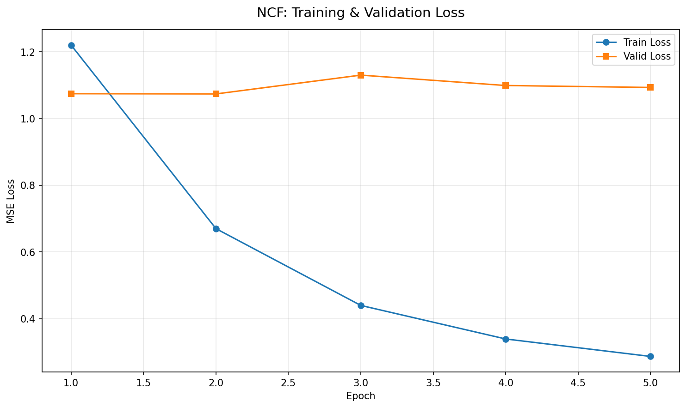

The training loss curve above shows the model converging. The training loss (blue) decreases steadily, while the validation loss (orange) levels off — early stopping kicks in at the right moment to prevent overfitting.

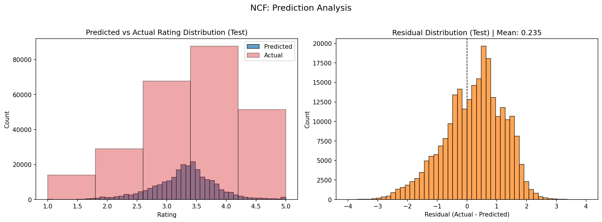

### 5. Model Comparison

I compared both models head-to-head across all metrics on the held-out test set.

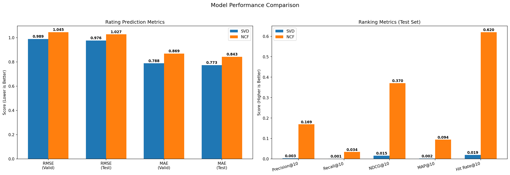

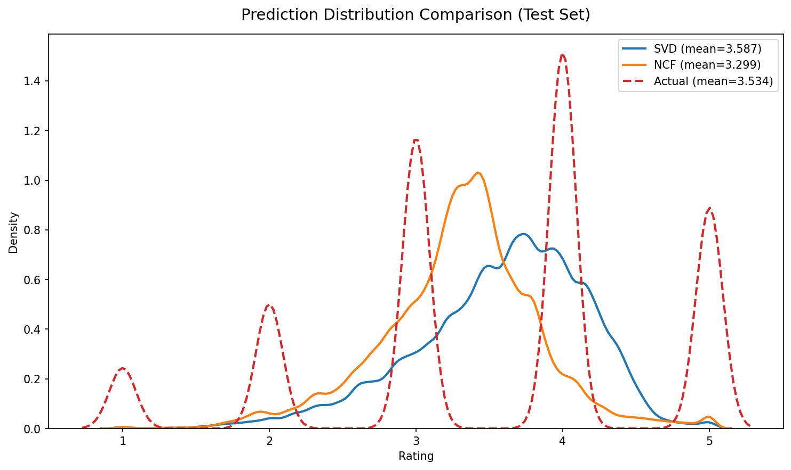

The prediction overlay shows how each model's predicted rating distribution compares to the actual ratings. Both models produce reasonable predictions, but they distribute predictions differently.

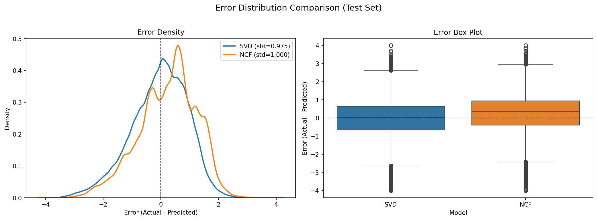

The error distribution shows how far off each model's predictions are from the true ratings. A tighter distribution centered at zero means more accurate predictions.

---

## Results

### Rating Prediction Metrics (Test Set)

| Metric | SVD | NCF |
|--------|-----|-----|
| RMSE | **0.9761** | 1.0275 |
| MAE | **0.7729** | 0.8426 |

### Ranking Metrics (Test Set, K=10)

| Metric | SVD | NCF |
|--------|-----|-----|
| Precision@10 | 0.0026 | **0.1692** |
| Recall@10 | 0.0008 | **0.0337** |
| NDCG@10 | 0.0155 | **0.3705** |
| MAP@10 | 0.0021 | **0.0940** |
| Hit Rate@10 | 0.0193 | **0.6200** |
| Coverage | 0.0172 | **0.2963** |

### Interpretation

The results reveal an important lesson about recommender systems: **rating prediction and ranking are two fundamentally different tasks**, and a model can be good at one while struggling at the other.

**SVD wins on rating prediction.** It achieves a lower RMSE (0.9761 vs 1.0275) and MAE (0.7729 vs 0.8426). This means that when SVD predicts a user will rate a movie 3.5 stars, it tends to be closer to the actual rating. This makes sense — SVD is essentially a regression model that directly minimizes prediction error.

**NCF wins overwhelmingly on ranking.** The ranking metrics tell a completely different story. NCF achieves a Hit Rate@10 of 0.62, meaning that for 62% of users, at least one truly relevant movie appears in the top-10 recommendations. SVD's Hit Rate@10 is only 1.9%. Similarly, NCF's NDCG@10 of 0.3705 dwarfs SVD's 0.0155 — NCF is far better at placing relevant movies near the top of the recommendation list.

**Why does this happen?** SVD optimizes globally for rating accuracy — it tries to get every single prediction as close to the true rating as possible. But a recommender system's real job is not to predict exact star ratings; it is to rank the right movies above the wrong ones for each user. NCF's neural network architecture with learned embeddings captures the nuanced, non-linear patterns in user behavior that make it much better at distinguishing "this user would love this movie" from "this user would find this movie mediocre."

**Bottom line:** If I were deploying this system, I would choose **NCF** as the production model. In a real recommendation scenario, what matters is whether the movies I show a user are ones they would actually enjoy — and NCF is dramatically better at that task. The slightly higher RMSE is an acceptable trade-off for a model that surfaces relevant content 62% of the time versus 2% of the time.

---

## Evaluation Metrics

I evaluated both models using two families of metrics, which is best practice in recommender systems research.

### Rating Prediction Metrics

These measure how close the predicted star ratings are to the actual ratings. They are computed across all user-movie pairs in the test set.

| Metric | What It Measures | Intuition |
|--------|-----------------|-----------|
| **RMSE** (Root Mean Squared Error) | Average magnitude of prediction errors, with larger errors penalized more heavily | If RMSE is 0.98, a typical prediction is about 1 star off. RMSE punishes big misses (predicting 5 when the user rated 1) more than small misses. |
| **MAE** (Mean Absolute Error) | Average magnitude of prediction errors, treating all errors equally | If MAE is 0.77, a typical prediction is about 0.8 stars off. More robust to outliers than RMSE. |

### Ranking Metrics

These measure how good the model is at putting relevant movies at the top of a user's recommendation list. They are computed per-user and then averaged. I define a movie as "relevant" if the user rated it 4 or higher — this is the standard threshold in the literature, since 4-5 star ratings indicate genuine enjoyment while 3 is ambiguous.

| Metric | What It Measures | Intuition |
|--------|-----------------|-----------|
| **Precision@10** | Of the 10 movies I recommended, how many did the user actually like? | If Precision@10 is 0.17, about 1.7 out of every 10 recommendations are relevant. |
| **Recall@10** | Of all the movies the user liked in the test set, how many did I find in my top 10? | If Recall@10 is 0.034, I am finding about 3.4% of a user's liked movies. Recall is naturally low when users have many liked movies but I can only recommend 10. |
| **NDCG@10** (Normalized Discounted Cumulative Gain) | Are the relevant movies near the top of the list? | NDCG gives more credit for relevant items at position 1 than position 10. A score of 0.37 means relevant items tend to appear in the upper half of the list. |
| **MAP@10** (Mean Average Precision) | Across all relevant items in the top 10, how precise was the list at each hit? | MAP rewards models that front-load relevant items. It is a stricter version of Precision@10 that cares about ordering. |
| **Hit Rate@10** | Did I get at least one relevant movie in the top 10? | The most intuitive metric. A Hit Rate of 0.62 means 62% of users see at least one movie they would enjoy in their recommendations. |
| **Coverage** | What percentage of the movie catalog am I recommending across all users? | Coverage of 0.30 means 30% of movies appear in at least one user's top-10 list. Higher coverage means the model surfaces a diverse set of movies rather than always recommending the same popular titles. |

---

## Key Design Decisions

| Decision | Rationale |
|----------|-----------|
| **MovieLens 1M** (not 10M or 25M) | Large enough to produce meaningful results (~1M ratings), small enough to train both models quickly. It is the most widely used benchmark in recommender systems research, making my results easy to contextualize. |
| **Chronological split** (not random) | A random split would let the model "cheat" by learning from ratings that happen in the future. A chronological split simulates reality: I train on past behavior and predict future behavior. |
| **Implemented SVD from scratch** (not using the Surprise library) | I used `scipy.sparse.linalg.svds` directly to demonstrate that I understand the linear algebra behind matrix factorization, rather than treating it as a black box. |
| **PyTorch for NCF** (not TensorFlow/Keras) | PyTorch is the industry standard for ML research and is increasingly used in production. It offers more flexibility and easier debugging than TensorFlow. |
| **Combined GMF + MLP architecture** | The NeuMF design from He et al. (2017) gets the best of both worlds: linear interaction modeling (GMF) and non-linear deep learning (MLP). Using both pathways consistently outperforms either alone. |
| **Both rating and ranking metrics** | Rating accuracy alone is misleading. A model could predict every rating as 3.5 stars and achieve decent RMSE, but its recommendations would be useless. Ranking metrics measure what actually matters: does the model surface the right movies? |
| **Relevance threshold of 4.0** | Ratings of 4 and 5 indicate genuine enjoyment. A rating of 3 is ambiguous — the user thought the movie was just "okay." Ratings of 1-2 are clear negatives. This threshold is standard in the literature. |
| **K=10** | Ten recommendations is a realistic number for a "top picks" row on a streaming platform. It is also the most common K value in academic benchmarks, making my results comparable to published work. |
| **Parquet format** | Parquet is a columnar storage format that is more efficient than CSV — smaller file sizes, faster reads, and automatic type preservation. It is the standard format for data engineering workflows on AWS. |
| **Optuna for tuning** | Optuna uses Bayesian optimization, which is smarter than grid search or random search. It learns from previous trials to focus on the most promising regions of the hyperparameter space, finding better models in fewer trials. |
| **Early stopping** | Instead of picking a fixed number of training epochs, I let the model train until validation performance stops improving. This automatically prevents overfitting without manual intervention. |
| **Self-contained notebooks** | Each notebook defines its own classes and can run independently. This avoids import dependencies between notebooks and ensures each step is reproducible on its own. |

---

## Getting Started

### Prerequisites

- Python 3.8+
- AWS credentials configured with access to S3 bucket `recommender-system-demo`
- (Optional) CUDA-compatible GPU for faster NCF training

### Installation

```bash
pip install -r requirements.txt
```

### Running the Pipeline

Execute notebooks in order on AWS SageMaker:

1. `00_data_collection/notebook.ipynb` — Downloads the MovieLens 1M dataset and uploads it to S3
2. `01_eda/notebook.ipynb` — Explores the dataset with visualizations
3. `02_split_data/notebook.ipynb` — Creates chronological train/validation/test splits
4. `03_svd/notebook.ipynb` — Trains and evaluates the SVD baseline model
5. `04_neural_collaborative_filtering/notebook.ipynb` — Trains and evaluates the NCF deep learning model
6. `05_comparison/notebook.ipynb` — Compares both models head-to-head
